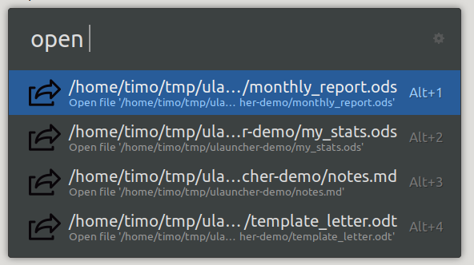

# ulauncher-openlistedfile

This is an experimental extension for [Ulauncher](https://ulauncher.io) which shows a list of files defined in a local config file and opens the selected.

This is a easy way to have access to regular used files in ulauncher.

The config file (configurable, default '~/.config/openlistedfile.conf') has one entry per line:

```
/home/timo/tmp/ulauncher-demo/monthly_report.ods
/home/timo/tmp/ulauncher-demo/my_stats.ods
/home/timo/tmp/ulauncher-demo/notes.md
/home/timo/tmp/ulauncher-demo/template_letter.odt
```

If you type the keyword, all entries will be shown in the list:



## Notes

+ As i just started using Python and ULauncher, most of the code is based on working extension https://github.com/jyvern/ulauncher-ssh

+ The icon was taken from https://www.shareicon.net


